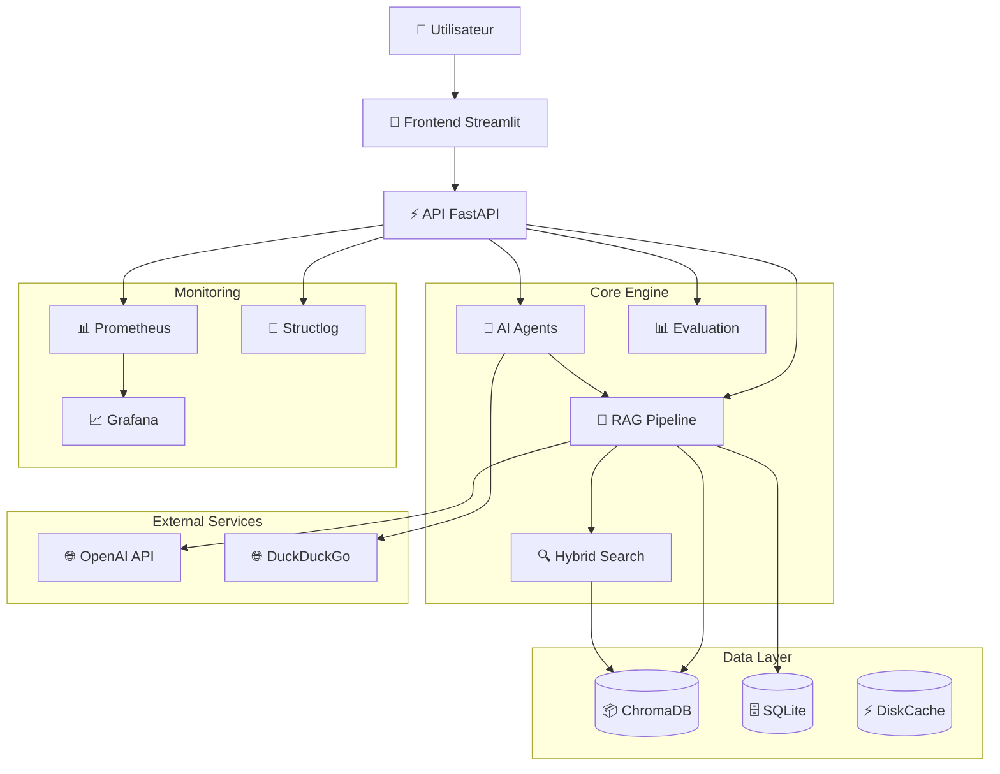
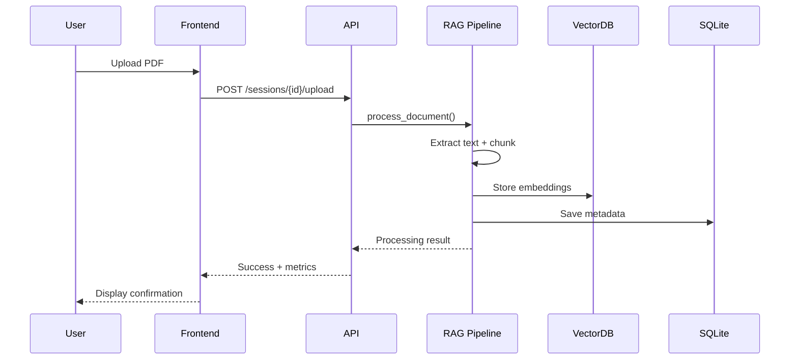
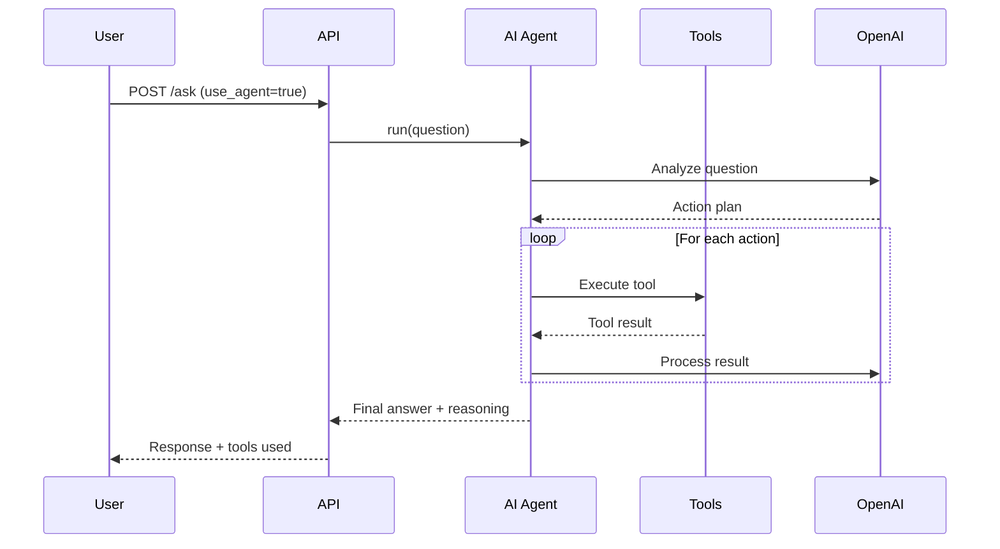
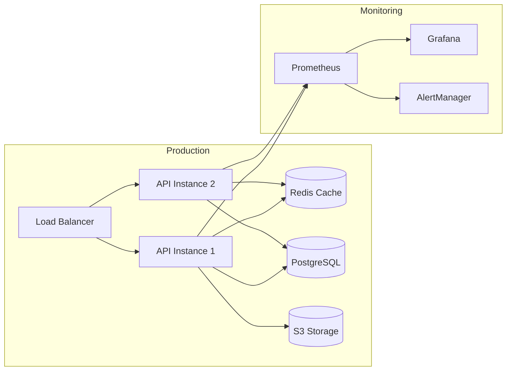

# Architecture RAG-Analyst v2.0

## Vue d'Ensemble

RAG-Analyst est une plateforme d'analyse de documents par IA générative, conçue avec une architecture moderne, scalable et orientée production.

## Architecture Système (C4 Level 2)



## Flux de Données

### 1. Upload et Traitement de Document



### 2. Question avec Agent IA



## Composants Principaux

### 1. API Layer (`app/main.py`)
- **FastAPI** avec 25+ endpoints
- **CORS** configuré pour Streamlit
- **Middlewares** : Security headers, Request logging, Rate limiting
- **Validation** : Pydantic models strictes
- **Endpoints clés** :
  - `/sessions/*` : Gestion des sessions
  - `/ask` : Question-réponse standard
  - `/ask-stream` : Streaming SSE
  - `/evaluation/*` : Tests automatisés
  - `/metrics/prometheus` : Monitoring

### 2. RAG Engine (`app/core/`)

#### a) `advanced_rag.py` - Pipeline RAG Avancé
- Gestion multi-documents par session
- Chunking intelligent avec métadonnées
- Compression contextuelle optionnelle
- Tracking complet des performances

#### b) `agents.py` + `tools.py` - Système d'Agents
- Pattern **ReAct** (Reasoning + Acting)
- 5 outils intégrés :
  - Calculator : Calculs mathématiques
  - Web Search : Recherche internet (DuckDuckGo)
  - DateTime : Date/heure actuelle
  - Document Query : Interrogation des docs
  - Text Analysis : Analyse de texte
- Affichage du raisonnement étape par étape

#### c) `hybrid_search.py` - Recherche Hybride
- **BM25** pour recherche par mots-clés
- **Semantic Search** pour recherche vectorielle
- **RRF** (Reciprocal Rank Fusion)
- **CrossEncoder** reranking pour affiner

#### d) `query_optimizer.py` - Optimisation de Requêtes
- **Query Expansion** : Génération de variations
- **HyDE** : Hypothetical Document Embeddings
- **Query Decomposition** : Sous-questions

#### e) `evaluation.py` + `rag_evaluation_suite.py` - Évaluation
- Métriques RAG : Relevance, Faithfulness, Precision, Recall
- ROUGE scores pour comparaison
- Suite de tests automatisés
- Génération de rapports HTML

### 3. Data Layer

#### a) ChromaDB (Vector Store)
- Stockage des embeddings OpenAI
- Un vector store par session (`chroma_db/session_{id}/`)
- Recherche par similarité cosine
- Persistance sur disque

#### b) SQLite (Metadata Store)
- Sessions utilisateur
- Documents traités
- Historique des conversations
- Métriques d'évaluation
- Schema avec SQLAlchemy ORM

#### c) DiskCache (Performance Cache)
- Cache des embeddings calculés
- Cache des réponses fréquentes
- Réduction des coûts API

### 4. Monitoring & Observabilité

#### Prometheus Metrics
- Requêtes API (count, duration, status)
- Questions RAG (count, duration, scores)
- Documents (processing time, chunks)
- Agents (tool usage, execution time)
- Erreurs (par type, par composant)

#### Structured Logging
- Tous les événements loggués avec **structlog**
- Format JSON pour parsing facile
- Corrélation par session_id
- Niveaux : INFO, WARNING, ERROR

## Décisions d'Architecture

### Choix Techniques

| Décision | Choix | Alternatives Considérées | Raison |
|----------|-------|-------------------------|---------|
| Framework API | FastAPI | Flask, Django REST | Performance async, validation Pydantic, doc auto |
| Vector DB | ChromaDB | Pinecone, Weaviate, FAISS | Gratuit, local, facile à setup |
| LLM Framework | LangChain | LlamaIndex, Custom | Ecosystème complet, agents intégrés |
| Database | SQLite | PostgreSQL, MongoDB | Simplicité, pas de serveur requis |
| Frontend | Streamlit | React, Vue | Rapid prototyping, Python natif |
| Monitoring | Prometheus | Datadog, New Relic | Open-source, standard industrie |
| Testing | Pytest | Unittest, Nose | Fixtures puissantes, plugins riches |
| Containerization | Docker | Podman, containerd | Standard de facto, bon ecosystem |

### Trade-offs

#### 1. SQLite vs PostgreSQL
**Choix : SQLite**
- ✅ Avantages : Zero config, portable, gratuit
- ❌ Inconvénients : Pas de concurrence élevée, limites de scalabilité
- **Quand migrer** : >1000 sessions actives ou besoin de multi-instance

#### 2. ChromaDB Local vs Cloud Vector DB
**Choix : ChromaDB Local**
- ✅ Avantages : Gratuit, privacité des données, latence minimale
- ❌ Inconvénients : Pas de réplication, backup manuel
- **Quand migrer** : Besoin de haute disponibilité ou multi-region

#### 3. Synchrone vs Asynchrone
**Choix : Hybrid (FastAPI async + sync core)**
- ✅ FastAPI async pour I/O
- ✅ Core logic synchrone (LangChain)
- Bon compromis simplicité/performance

## Patterns & Best Practices

### 1. Separation of Concerns
```
Frontend (UI) → API (Business Logic) → Core (Domain Logic) → Data (Persistence)
```

### 2. Dependency Injection
```python
def endpoint(db: Session = Depends(get_db)):
    # Testable, modulaire
```

### 3. Error Handling
- Exceptions custom par couche
- Logging structuré systématique
- Fallbacks gracieux

### 4. Configuration
- Variables d'environnement (`.env`)
- Config par modèle centralisée
- Sélection adaptative de modèles

## Scalabilité

### Limitations Actuelles
- Single-instance (pas de load balancing)
- SQLite (limite de concurrence)
- In-memory state (current_pipeline, current_agent)
- Pas de queue pour jobs longs

### Plan de Scaling

#### Phase 1 : Optimisation Verticale
- Redis pour cache distribué
- PostgreSQL pour DB
- Connection pooling optimisé

#### Phase 2 : Scaling Horizontal
- Load balancer (Nginx)
- Multiple API instances
- Shared state avec Redis
- Queue système (Celery + RabbitMQ)

#### Phase 3 : Cloud Native
- Kubernetes deployment
- Auto-scaling pods
- Distributed tracing
- Multi-region

## Sécurité

### Implémentations Actuelles
- ✅ Rate limiting (100 req/heure par IP)
- ✅ Security headers (HSTS, XSS, etc.)
- ✅ Input validation (Pydantic)
- ✅ Request logging complet
- ✅ CORS configuré

### À Ajouter pour Production
- JWT authentication
- Role-based access control (RBAC)
- API key management
- WAF (Web Application Firewall)
- Chiffrement des données sensibles
- Audit trail complet

## Performance

### Optimisations Actuelles
- Chunking optimisé (1000 chars, 200 overlap)
- Batch embedding possible
- Cache disque des embeddings
- Context compression avec LLM

### Métriques Cibles
- Temps de réponse : <3s (p95)
- Temps de traitement document : <30s/page
- Score de confiance : >0.7 (moyenne)
- Disponibilité : >99%

## Monitoring

### Dashboards Grafana
1. **Operational Dashboard**
   - Requêtes/minute
   - Temps de réponse (p50, p95, p99)
   - Taux d'erreur
   - Sessions actives

2. **Quality Dashboard**
   - Scores de confiance
   - Scores d'évaluation RAG
   - Taux de passage des tests

3. **Business Dashboard**
   - Documents traités
   - Questions par catégorie
   - Coûts API estimés
   - Utilisation des agents

## Coûts

### Estimation Mensuelle (1000 questions/mois)
- OpenAI embeddings : ~$0.10
- OpenAI GPT-3.5 : ~$2.00
- Agent avec outils : ~$3.00
- GPT-4 (si utilisé) : ~$30.00

**Total : $5-35/mois selon usage**

## Roadmap Future

### Court Terme (1-2 mois)
- [ ] Authentification JWT
- [ ] PostgreSQL migration
- [ ] Cache Redis
- [ ] Streaming réel (pas simulé)

### Moyen Terme (3-6 mois)
- [ ] Support multi-langue
- [ ] Fine-tuning de modèles custom
- [ ] Multi-modal complet (images, tableaux)
- [ ] Agents avancés avec memory

### Long Terme (6-12 mois)
- [ ] Kubernetes deployment
- [ ] Auto-scaling
- [ ] Multi-tenant SaaS
- [ ] Marketplace d'agents custom

## Diagramme de Déploiement



## Contact & Contribution

Pour toute question sur l'architecture ou proposition d'amélioration, consultez le README.md.

---
*Document maintenu par : Équipe RAG-Analyst*
*Dernière mise à jour : Octobre 2024*

